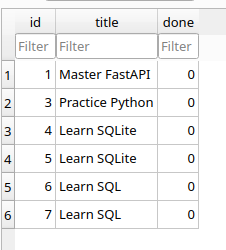

# Todo API with SQLite

## Project Description

This project is a CRUD (Create, Read, Update, Delete) Todo API built using FastAPI and SQLite. It allows users to create, read, update, and delete tasks. Unlike the previous version, tasks are stored permanently in a SQLite database, so the data is not lost when the server restarts.

## Why SQLite?

SQLite was chosen because it is lightweight, easy to use, and does not require a separate database server. It stores all data in a single file, making it suitable for beginner backend projects.

## Database Location

The database file is stored in the project folder as:

```
tasks.db
```

## How to Run the Project

1. Clone the repository.

```bash
git clone https://github.com/muhammadkashanraza138-hub/todo-api.git
```

2. Go to the project folder.

```bash
cd todo-api
```

3. Activate the virtual environment.

```bash
source venv/bin/activate
```

4. Start the FastAPI server.

```bash
uvicorn main:app --reload
```

5. Open Swagger UI.

```
http://127.0.0.1:8000/docs
```

## Example SQL Query

```sql
SELECT * FROM tasks;
```

## Database Screenshot

